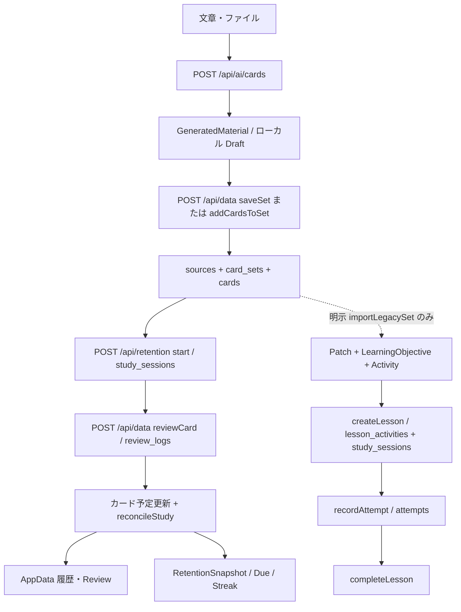

# Patch Free v1 Learning Core 実装計画

> これは前回監査の履歴です。最新 Dev 基準での実装結果と変更後のルールは [実装記録](free-v1-learning-core-implementation.md) を参照してください。

作成日: 2026-09-21。状態: **調査・設計提案のみ。学習機能の実装は行っていない。**

## 0. 目的・調査対象・結論

Free v1 は短いトピック、貼り付け文章、現在対応するファイルから **Flashcards / Multiple Choice の2形式**を生成し、Material → AI Generation → Review / Save → Study → Complete → History / Review → Streak / Retention → Repeat を成立させる。TestFlight → 実ユーザー → PMF 検証のための最小スコープとする。Fill in the Blank は含めない。

| 対象 | 調査したコミット | 扱い |
| --- | --- | --- |
| 共有 Dev | `716d298d8361d217eb1c16ec898a1958861a91bc` | 現行基準。指定値と一致 |
| Add Material | `70061ea0b46e3e47221db5e194601695c6017b46` | 最終確認時の HEAD。読み取り専用 |
| Add Material 初回調査・テスト対象 | `44279fd2b783610feab8a99682a357a3999dd879` | 指定の `ab8192c` より新しい MCQ 構造整合修正を含む |
| 本書を追加する作業ブランチの開始点 | `codex/patch-parallel-2` / `d382da86abdee4253705bc3d457a247536a5b961` | Dev と異なるため、このチェックアウトを現行 Dev と見なしていない |

調査はローカルの実ブランチ参照を `git rev-parse` / `git show` / `git archive` で確認した。リモート fetch、他の作業ツリーの編集、Dev への merge は行っていない。調査中の `44279fd` → `70061ea` は Dev のリリース準備取り込みで、`app/`・`lib/`・`db/` と今回実行した Add Material テストの差分はない。以下 **[D] は Dev、[A] は最終 Add Material** のファイル・シンボルを指す。行番号よりシンボルとコミットを優先して参照する。

**結論:** 両形式ともカードとして生成・保存・学習でき、従来のカード経路には履歴、復習予定、Retention が既にある。ただし通常学習の完了は「全問を消化」ではなく「全問で成功を記録」であり、Free v1 の要求と不一致。MCQ 判定は AI 不使用だがクライアントで計算され、サーバーは結果を信用している。短いトピック単体は非対応。Free v1 は **既存 Card / ReviewLog / study_sessions の経路を補強**する。汎用 Domain の Patch / Objective / Activity / Attempt / Lesson は保持し、移行や Composer 完成を条件にしない。

## 1. 現在のアーキテクチャ

同じ UI 内に、次の二つの経路が共存する。「Patch」「Lesson」という画面名だけで保存先を判断してはいけない。



図の二つの `study_sessions` は同じテーブル。`patch_id IS NULL` の従来カードセッションと、`patch_id` を持つ native Domain Lesson を区別する。native Lesson 完了から既存 Retention への接続矢印は現状存在しない。

| 層 | カード経路（Free v1 の再利用先） | 汎用 Domain 経路（維持） |
| --- | --- | --- |
| コンテンツ | `CardSet`, `Card`, `GeneratedMaterial` | `Patch`, `Source`, `LearningObjective`, `Activity` |
| Flashcard | `format: qa`, `question`, `answer`, `choices: []` | `Activity.type: RECALL` |
| MCQ | `format: multiple_choice`, `choices: string[]`, `answer: string` | `Activity.type: CHOICE`, `metadata.choices` |
| 割当 | `study_sessions.card_ids` の固定順序 | `lesson_activities.position` の固定順序 |
| 証跡 | `ReviewLog` / `review_logs` | `Attempt` / `attempts` |
| 結果 | `good` / `again`（過去の `hard` / `easy` も型に残る） | `CORRECT` / `INCORRECT` / `COMPLETED` |
| 復習状態 | `cards` の due / interval / counts | `ObjectiveState` は明示書込みの保管のみ |
| 主な入口 | [D] `app/page.tsx: Study, startStudy` | [D] `features/my-lesson/domain-adapter.ts` |

MCQ は既存 Card の正規の format であり、単なる Q/A への文字列変換ではない。ただし専用 MCQ テーブルはなく、カード共通の保存・review を使う。Domain でも CHOICE は正規 Activity type。`importLegacySet` は1カードにつき Objective と Activity を作る明示操作で、Add Material 保存から自動実行されない。再 import は既存 Patch を返し、後から追加・編集したカードの継続同期ではない。

根拠: [D] `lib/types.ts`, `lib/domain/{types,legacy,service}.ts`, `db/{schema,domain-schema,retention-schema}.ts`。

## 2. Generation → Review / Save の共通契約

### 2.1 アプリから AI API への入力

`POST /api/ai/cards` は認証済み account/session と `Idempotency-Key` を使う。JSON は `text`, `detail`, `style`, `language`、任意の `category`, `mode`、[A] では任意の `focus`。AI クライアントは privacy 用 `operationId` も同じキーに合わせる。

- `mode`: 現行は `source`（デフォルト）または `lesson_summary`。`topic` は存在しない。未知の mode は source として扱われる。
- source の trim 後入力は80〜30,000文字。lesson_summary の最小は20文字。HTTP body 上限128 KiB。これとは別に provider payload の入力上限がある。
- `style`: `一問一答` / `qa` → `qa`、`4択問題` / `multiple_choice` → `multiple_choice`。`自分で解説` / `self_explain` は将来互換として残る。未知の style は qa にフォールバックする。
- [A] Build の format 選択は Flashcards / Multiple choice の2択。detail は要点のみ／標準／詳しく。カード枚数は AI が決める。
- [A] `focus` は1〜1,000文字。既存 source 内の論点の絞り込みであり、短いトピックから一般知識を生成する機能ではない。
- [A] `materialSource` が貼り付け文章と accepted 添付の抽出文章を結合する。最大5添付、1ファイル10 MiB、合計入力30,000文字。対応は PDF / DOCX / PPTX / TXT / MD / CSV。PDF は最大200ページ、文字抽出のみで OCR はない。画像のみ、パスワード付き、壊れた資料などは既存エラーへ戻す。元ファイル本体を学習DBへ保存する経路ではない。

根拠: [D/A] `app/api/ai/cards/route.ts`, `lib/document-import.ts`; [A] `lib/{material-limits,build-draft}.ts`, `app/build-patch.tsx`, `app/use-build-generation.ts`。

### 2.2 Provider schema とアプリ response schema

[D/A] `lib/openai.ts: prepareMaterial` は provider Responses API に strict JSON schema を送り、生成時の通常モードは3〜20カード、summary は1〜6カード、keyPoints は1〜8個。モデルはコード上 `gpt-5-nano` に制限される。source のみを根拠に、資料にない知識を追加しないプロンプト。

アプリが受け取る最終形は両形式で共通:

```ts
type GeneratedMaterial = {
  title: string; category: string; summary: string; keyPoints: string[];
  cards: Array<{
    question: string; answer: string; difficulty: number; // 1..3
    format: 'qa' | 'multiple_choice' | 'self_explain';
    choices: string[];
  }>;
};
```

| 内容 | Flashcard | MCQ |
| --- | --- | --- |
| [D] Provider のカード | `question, answer, difficulty, format, choices: []` | `question, answer, difficulty, format, choices[4]` |
| [A] Provider のカード | 同上 | `question, difficulty, format, choices[4], correctChoiceIndex: 0..3`。`answer` を要求しない |
| [A] サーバー正規化 | answer を維持 | choices を trim し `answer = choices[correctChoiceIndex]`。index は response から除く |
| 保存される正解 | answer 本文 | answer と一致する choice の本文。index や専用 correct-choice ID は保存されない |

生成結果は **学習可能な最終 content の候補**。Learning Objective、Lesson、Activity Composer 用の中間アウトラインではない。`summary` / `keyPoints` は教材表示の説明で、実際に Study するのは `cards`。

### 2.3 Validation / malformed output / retry

- Provider strict schema と、サーバー独自の runtime 検証は同一ではない。両者を「完全な runtime validation 済み」と見なさない。
- [D] parse、空 cards、MCQ choices 数・answer 包含を確認する。普通の Error で失敗する箇所は `runAi` で unknown 扱いになり得る。
- [A] JSON parse failure、空 cards、MCQ の4選択肢、非空文字列、trim 後重複なし、正解 index の整数範囲を `ProviderError(false)` で確定失敗に分類。参照関係を index から決定するため、answer と choices の文章不一致を解消している。
- [A] でも全フィールドの型・文字数・生成上限・requested format を parse 後に一括検証してはいない。Flashcard の answer、title/keyPoints などは downstream の UI / save validation に依存する部分がある。
- `/api/data: validCards` は保存前に1〜100カード、question 5,000文字、answer 10,000文字、difficulty 整数1〜3、既知 format、MCQ の非空・重複なし4択・answer 包含、他形式の choices 空配列を検証する。教材 title は120文字、category は60文字など別の制限がある。Provider schema と保存制限の差は残る。
- [A] `reviewContentError` が欠けた outcomes / content / MCQ を save 前に止める。draft の型キャスト自体は validator ではないので、Free v1 では UI に渡す前の正規化済み response validator を共有する。
- `runAi` は `ai_requests` の account + key hash + payload fingerprint と privacy/lifecycle 検証で admission・dispatch・結果を管理する。成功結果は保存用教材とは別に約24時間再取得可能。unknown/in-progress の同キー再送で provider を再実行しない。期限切れ・確定失敗・明示的な新規生成を区別する。[A] は前の unknown が残る場合の `AI_PREVIOUS_UNRESOLVED` を追加している。
- ネットワーク層は自動再送しない。通常APIは30秒、AIクライアントは75秒、provider 呼出しは45秒の期限。送信後 timeout は「保存／生成がなかった」証明ではない。

根拠: [D/A] `lib/{openai,ai-client,api-client}.ts`, `lib/ai/{control,execution}.ts`, `lib/reliability/transport.ts`, `app/api/data/route.ts`; [A] `lib/material-save.ts`。

### 2.4 Add Material が実際に永続化するもの

[A] `useBuildGeneration` が `GeneratedMaterial` に `sourceContent`, `draftId`, `selected` を加え、account-scoped workspace に draft と generation fingerprint/key を保存する。Review の Preview は実カード内容の表示・答え reveal のみ。**Preview は review / Attempt / 学習セッション / Retention を書かない。** 新規名と保存先を選び、保存ボタンで初めて教材を書き込む。

- 新規保存: `sources` に結合した抽出本文、`card_sets` に title/category/summary/keyPoints/sourceId/folderId、`cards` に選択済みカードの最終内容。
- 既存セットへ追加: 新しい cards、既存 source への区切り付き本文追記、set の updatedAt / nextReviewAt。既存タイトル・summary・keyPoints を新しい教材のものへ置換しない。
- 新規 card は `未学習`, due=now, interval=0, reviewCount=0, correctCount=0。保存だけで learning evidence / completed session / Streak は作らない。
- DB `patches`, `learning_objectives`, `activities`, `lesson_activities`, `attempts` は生成も保存もされない。
- [A] Save API は `operationId` を任意で受け、`setId`, `cardIds`, `data` を返す。現行 Build は必ず operationId を送る。[D] はこの保存冪等性拡張がない。
- [A] `persistMaterialOnce` は userId + operationId + payload digest から deterministic card IDs を作り、既存 cards を receipt として使う。再送は同じ ID を返し、本文追記を含めて二重保存しない。異なる payload は409。1 write transaction で set/source/cards をまとめる。soft deletion 後も receipt は残る。operationId なしの互換呼出しに同じ保証はない。
- 保存成功後 Ready。`Start my lesson` は返却された新規 cardIds を `startStudy` に渡すが、server planner が選んだ subset がそのセッションの全割当になる。教材内の全 cards を必ず一度のセッションに入れるわけではない。Ready は React state で、reload 後は保存済み教材を Home/一覧から見つける。
- unknown save は正確な pending payload を workspace に保持し、編集をロックして同じ操作を再送する。ただし既存 `useWorkspace` は storage 書込み失敗を警告に留めるため、pending の耐久保存が保証されない端末での送信停止は追加対応が必要。

根拠: [A] `app/{use-material-save,use-build-generation}.ts`, `app/build-review.tsx`, `lib/{material-save,workspace}.ts`, `db/store.ts: materialStatements, addCardsToSet, persistMaterialOnce`, `app/page.tsx: startStudy`。

## 3. 所有権・アカウント境界

HTTP は `requireAuth` で Clerk identity を内部 user UUID に解決し、`x-patch-session` / `x-patch-account` の一致を要求する。body の userId を所有者として信用しない。sources / sets / cards / reviews / study_sessions / retention は user 条件で読み書きする。保存先 set/folder と session 開始時の cards の所有者も確認する。

Domain repository はすべての query/write に `user_id` を追加し、1 command = 1 write transaction 内で active account を再確認する。Domain の関係には user を含む複合FK・Attempt operation の一意制約がある。`ObjectiveState.version` は比較更新。従来テーブルと同等のFK構成だと仮定してはいけない。

ローカル workspace は `patch:workspace:v2:<userId>` に owner envelope 付き。Lesson checkpoint は `patch:lesson:<userId>`。account scope が遅れて届いた旧アカウントの結果を止める。これらは server authority の代用ではない。カード経路の `reviewCard` は **card の所有者を確認するが、session の存在・同一所有者の割当 membership・完了済みかを検証していない**。他人のカードは書けないものの、任意の sessionId を付けた自己カードの review が保存できる。Free v1 answer command で塞ぐ。

根拠: [D] `lib/auth-server.ts`, `db/auth-store.ts`, `lib/account-scope.ts`, `lib/account-storage.ts`, `app/use-workspace.ts`, `db/domain-repository.ts`, `db/store.ts: reviewCard`, `db/retention.ts: startStudySession`。

## 4. Flashcard の全 lifecycle

1. 入力と形式 qa を選び、生成。question が front、answer が back、choices は空。Review で実内容を確認して保存する（2章）。
2. Home / セット / 復習 / Ready から開始。候補を server が割当し、カードの順序を固定する（6章）。
3. [D] `Study` が `queue[0]` の question を表示する。tap / keyboard などで `flipped` を変更し answer を reveal。reveal だけでは証跡を保存しない。
4. 「覚えていた」=`good`、「まだ覚えていない」=`again` の自己評価。reveal 前の submit を UI が抑止する。入力した自然言語の答えを採点する機能ではない。
5. `pendingReview` を保持し `reviewCard` を送る。サーバーが ReviewLog、カード schedule/count、set の lastStudiedAt / nextReviewAt を同一 transaction で更新する。
6. 通常学習: good は queue から外れ、again は末尾へ戻る。onboarding の最初の3枚だけは again でも消化する。5枚 batch は画面単位であり、残り batch があればセッション完了ではない。
7. 通常の全割当で good/easy が保存されて初めて server 完了。UI は別に queue 空から done を設定する。reveal / 自己評価 / 結果 / progress は完全に単一の server view になっていない。
8. ReviewLog から履歴へ、cards の due/interval から復習へ、qualifying completion から Retention へ繋がる。

Domain RECALL でも reveal → `remembered` / `practice` の自己評価を行う。adapter が `CORRECT` / `INCORRECT` を送り、INCORRECT は次に進めず同じ Activity の再試行を要求する。Attempt.response はこの自己評価の文字列、durationMs は現行 adapter では0。native Lesson 完了は11章の Retention には繋がらない。

**Free v1 gap:** 「覚えていない」でも1項目を消化し、全割当の終わりで完了できること。自己評価による review schedule は引き続き別に維持する。正答までの再試行を同一セッション完了の必須条件にしない。

根拠: [D] `app/page.tsx: Study.submitVerdict`, `lib/review.ts`, `lib/workspace.ts`, `features/my-lesson/{renderers,domain-adapter,state}.ts*`。

## 5. Multiple Choice の全 lifecycle

1. 4択を選択して生成。最新 [A] は provider の correctChoiceIndex をサーバーで answer 文字列へ変換して返す。保存では qa と同じ Card 構造に `format=multiple_choice`, choices[4] を持つ。
2. 開始・割当は Flashcard と共通。問題 `question` と choices を表示する。
3. [D] 選択ボタンが `selectedChoice` に choice **本文**を設定し `flipped=true` にする。選択直後は local state のみで、正解／不正解と答えを表示する。
4. 判定は `selectedChoice === card.answer` の通常コード。記録ボタンで改めて同じ判定を行い good / again を送る。**回答時 AI 呼出しは不要で、現状も採点に AI を使っていない。** 任意の AI 解説は別操作。
5. `/api/data reviewCard` に送られるのは rating と operation 情報で、選択肢そのものは送られない。server は choices/answer と照合せず rating を保存する。
6. 正解は queue から外れ、不正解は末尾へ戻る。feedback は端末表示、結果は ReviewLog の rating。履歴・schedule・Retention は Flashcard と同じ。
7. 同じ端末の未確定選択は workspace で復元できるが、確定した回答の選択肢は review_logs にない。別端末／ローカルデータ消去後に、どの誤答を選んだかは復元不能。

Domain CHOICE は choices を `{id: String(index), label}` に変換し、response の index を adapter で検証・answer と比較して Attempt を送る。Attempt.response には index が残る。ただし `lib/domain/service.ts: recordAttempt` は正解を再計算しないので、domain API へ直接偽の `CORRECT` を送ることは現在の規則で拒否されない。adapter が domain 名でもサーバー採点ではない。

**Free v1 gap:** persisted content に対するサーバーの決定論的採点、選択した回答を含む durable receipt、改変・二重送信・content 編集競合の検出、不正解も消化する共通進行。AI 採点、新しい MCQ エンジン、選択肢 shuffle は不要。

## 6. 共通 Study Session モデルと resume

### 6.1 カード経路の server と UI の実態

[D] `startStudy` が due / daily / long-term / セットの active cards から候補を選び、requested card があれば先頭へ置く。[A] Ready は保存直後の cardIds を候補にできる。

`POST /api/retention {action:'start', id, cardIds}` は非空・重複なし・最大1,000 IDs を検証。`startStudySession` が owner と active status を検証し、`planStudy` でおよそ300〜600秒になる先頭 subset を選ぶ。材料が少なければ300秒未満でも開始でき、`qualifies=false`。推定時間は question/answer の長さ、difficulty、format に依存し、実際の学習時間ではない。割当は DB の `card_ids` に保存される。

| 状態 | 現状の authoritative data | UI / 端末のみ |
| --- | --- | --- |
| 割当内容・順序 | `study_sessions.card_ids`, `estimated_seconds`, `qualifies` | 候補の選定、scope、returnTo |
| 学習済み証跡 | `review_logs`, Undo の `undone_at` | animation、pending submission |
| 現在位置 | サーバーに cursor 列／統一 view はない | `queue`, `remaining`, batch, mistakes |
| reveal / 未送信選択 | なし | `flipped`, `selectedChoice`, editor draft |
| 完了 | `completed_at` / `earned_day` | `StudySession.done` も独立に計算 |
| 中断 | 未完了 server row が残る | current / pausedSessions、screen |

legacy session の status / started_at は通常 NULL。`asLesson` が completedAt の有無から ACTIVE/COMPLETED を投影する。UI の `StudySession` と Domain の `Lesson` は別型である。

同じ端末では workspace の queue と pending operation を復元し、`/api/data?sessionId=...` の全 sessionReviews と照合する。500件の表示上限に依存しない。届いていた good をスキップし、失われた again response は一度だけ末尾へ回す。Undo IDs / operation IDs も照合する。deleted/archived cards はローカル queue から除外する。

別端末等では RetentionSnapshot の最新の未完了 legacy session の全 cardIds から workspace を作り、server reviews で残りを再計算する。**reveal、未送信選択、全 pausedSessions の一覧やローカルの厳密な queue 回転順は server にはない。** archived/deleted assignment が一つでもある session は Retention の resume 候補から外れる。一方、その session の DB 割当は残るため、ローカル queue 空と server 未完了が食い違い得る。

### 6.2 現行 retry と制限

- review は account + operationId の一意制約。cardId / sessionId / rating / previous.reviewCount を比較し、同じ request は元の reviewId を返す。responseMs の相違は現状の replay 比較対象でない。Undo 済み operation の replay は再適用しない。
- `expectedReviewCount` が合わなければ409。UI は最新データを読み、pending を照合する。transaction 全体失敗なら書込みは rollback され、同じ operation を再試行可能。
- 通常 start の再試行 ID は `pendingStudyStart` の React ref のみ。reload をまたいで start receipt を保持していないため、lost start response 後の新しい開始が別 session を作り得る。
- start の既存ID比較は保存済み割当が request の prefix と一致するかで、元の全候補と厳密比較していない。planner による subset を許すため、後ろの候補が変わっても同じ操作として返り得る。次の契約で「再送照合対象は固定済み割当」か「候補全体」かを明示する。
- `useWorkspace.update` は storage failure を握って警告し、Study への失敗通知を返さない。耐久 pending がないまま dispatch を続け得る。確実な再送保証には事前保存成功を必須にする。
- HTTP/client は1 dispatch。background、abort、timeout でもサーバー commit 済みの可能性があり、取り消したつもりで新しい operation を作らない。
- `reviewCard` 前の `loadDailyReview` と、commit 後の API 応答用 `loadAppData` は回答 transaction の外。応答の複数 query 全体が一つの整合 snapshot という保証はない。応答取得失敗でも回答は確定済みになり得る。新 session view は同じ transaction 内で組み立てるか、確定 receipt と照合できる形にする。

### 6.3 native Domain Lesson

`createLesson` は同じ Patch の Activity IDs を固定順で割当し、targetMinutes 5〜15、estimatedSeconds 合計300〜900を要求する。CREATED → ACTIVE → COMPLETED / ABANDONED。再 load は Activity ごとの全 Attempt を読み、最新の non-undone 成功から completedIds、最初の未成功から index を復元する。

`checkpoint.ts` は account ごとに1 Lesson の未送信 draft/reveal/response、revision、elapsedSeconds、pending RecordAttempt を保管。adapter は lesson + activity + predecessor から同一 operationId を再生成し、payload を固定して明示再送する。foreground timer は端末のみ。完成画面は server Lesson.status を使うが、そもそも成功必須の規則である。

汎用 createPatch/createObjective/createActivity/createLesson には一般的な request receipt がなく、lost create response の無条件 replay は新規 row を作り得る。recordAttempt の冪等性をすべての Domain command に一般化しない。

## 7. Attempt / Result と実際の学習証跡

| 項目 | Flashcard の現行カード経路 | MCQ の現行カード経路 | native Domain |
| --- | --- | --- | --- |
| 保存単位 | `review_logs` 1評価1行 | 同左 | `attempts` 1回答1行 |
| 結果 | 自己評価 good / again | クライアント計算の good / again | 明示 result enum |
| response | 未保存 | 選択内容未保存 | RECALL=remembered/practice、CHOICE=index文字列 |
| 時間 | `response_ms`、server が0〜1時間に制限 | 同左 | `duration_ms`。adapter は現在0 |
| retry identity | user + operationId、previous_state | 同左 | user + operationId + payloadHash |
| Undo | previous_state から schedule/count を復元 | 同左 | undoneAt。必要なら Lesson を ACTIVE に戻す |
| projection | cards の schedule/count を同時更新 | 同左 | ObjectiveState は自動更新しない |

Free v1 では ReviewLog を **既存の Attempt 相当**として扱える。view 上の `evidence.kind='LEGACY_REVIEW'`, `id=reviewId` を明示し、架空の Activity ID や偽の Attempt を作らない。[D] `lib/domain/legacy.ts: legacyReviewView` も同じ考えで、rating と duration を保持し response=null としている。review と attempts への無目的な二重書込みはしない。

`COMPLETED` という AttemptResult は現行 service では LEARN 専用。Flashcard / CHOICE の消化を実現するため全結果を COMPLETED に置き換えてはいけない。**回答の成否と、セッション項目を消化したことを分離する。** mastery scoring / ObjectiveState の自動更新は本計画に含めない。

## 8. 完了の現行定義と Free v1 の完成契約

### 8.1 現行の authoritative completion

| 経路 | 現行条件 | transaction / retry |
| --- | --- | --- |
| 通常カード session | 非空の割当すべてについて、同一sessionに non-undone good/easy review が一つ以上ある | review/undo transaction 内 `reconcileStudy` が completed_at と earned_day を設定／解除 |
| onboarding | 初期3枚すべてに non-undone review。rating を問わない | `completeFirstLearning` + `reconcileStudy`。profile/daily plan との接続もある |
| native Lesson | 非空の割当すべての **最新** non-undone Attempt が CORRECT または COMPLETED | `completeLesson` の別 command transaction。最終 Attempt 保存とは別 transaction |

通常カードは「過去に一度成功があればよい」であり、native Lesson の「最新が成功」とも違う。`completeLesson` は再実行時も evidence を検証し completedAt を維持する。Undo は必要なら完了を取り消す。legacy `reconcileStudy` は native `patch_id` のある session を明示的に処理しない。

現在の普通の両経路は、要求された **「全割当の最後まで到達したら完了」には一致しない**。例えば5問すべて回答し最後を間違えた場合、現状は通常 Study / native Lesson とも完了できない。

### 8.2 推奨する Free v1 契約（未実装）

1. start の成功時点でその session の ordered item IDs を固定する。教材全体の枚数や UI batch の枚数と区別する。
2. reveal / 選択だけでは消化しない。明示的な回答記録を server が受理したときに1項目を消化する。Flashcard は自己評価、MCQ は server が計算した成否を evidence に残す。
3. 正解／不正解どちらも次の assigned item へ進める。再練習は新しい Review session とし、初回完了を妨げない。again の due は引き続き now。
4. **全割当それぞれに有効な回答記録が揃った時点で COMPLETE**。最後の回答の evidence、schedule/count、session completion と earned day を同じ transaction で確定する。UI の「次へ」は保存済み snapshot の navigation に従い、最後の animation の実行・画面離脱は完了条件にしない。
5. 同じ回答 operation の replay は元の結果を返し、進捗／schedule／Streak を二重に進めない。同キー異 payload は409。完了済み session への新しい answer operation は拒否する。既存 receipt replay の検査を先に行う。
6. Undo が許可される場合は、evidence 無効化・schedule 復元・必要な completion/earned day の解除を同一 transaction に維持する。同日の別 qualifying completion は失わせない。
7. 消化数・current item・status は server snapshot から返す。CLI1 は残り queue 長、correctCount、経過分数から COMPLETE を推測しない。
8. archived/deleted/malformed な未回答割当は自動消化して Streak を付与しない。session view に回復可能な unavailable を返し、必要なら既存 `status` を使って中断扱いにし、active items で新規 session を作る。旧 row が Continue に出続けないよう server 選定も整合させる。
9. 既存の完了履歴を新ルールで一括再計算しない。新 Free v1 session の適用境界と、旧未完了sessionの扱いを implementation 前に契約化する。最小案は既存 nullable `status` / `started_at` を新カード経路で明示利用し、旧NULL状態は旧規則のまま保持する。旧未完了は終了扱いへ移して新 Free v1 session を開始できるようにし、過去の非成功reviewへ遡及的に earned day を付与しない。

これは Retention の日付・Streak・資格条件の再設計ではない。**Learning Core の完了 evidence の生成条件を要求に合わせ、既存 Retention が読む completed_at / earned_day に接続するための変更**。このタスクではどちらも変更しない。

## 9. History / Review 接続

- `loadAppData` は review_logs の最新500行を読み、undone を除いた reviews を返す。requested session IDs の reviews は別 query で上限なし。DBには500件より古い履歴も残る。
- Records の直近7日「記憶し直したカード数」は Tokyo 日付ごとの distinct good/easy card 数をDBで集計する。完了した session 数でも、回答した全項目数でもない。again だけで Free v1 session を終えた場合に棒グラフが0でも矛盾しないよう表示契約を区別する。
- セットの最終学習、次回復習、カード reviewCount / correctCount / 苦手 status が表示に使われる。現状は完成 session の一覧／形式別回答詳細を返す History API ではない。
- server `scheduleBinaryReview`: again → interval0、due=回答時刻、苦手、correctDelta0。good → 現在より大きい `[1,3,7,14,30,60,120,180,365]` 日、correctDelta1。14日以上は定着中、それ未満は復習待ち。どちらも reviewCount は増える。
- set.nextReviewAt は active cards の MIN(due_at)。Retention due は未学習を除くため、新しいカードを足しただけで次回復習表示が now でも Retention dueCount に含まれるとは限らない。
- due / daily / memory session の候補選択から既存 start へ戻る。long-term は定着中かつ interval≥60日を対象にしており、Free v1 の新しい mastery 要件ではない。
- native Attempts は活動単位 query と Lesson adapter の resume に使われるが、AppData.reviews / recordActivity / card schedule に投影されない。ObjectiveState.nextReviewAt も現在の Due Count には使われない。

**Free v1 の必要な補強:** completed session と assigned/result summary の account-scoped read model、同じ内容を再学習する start、失敗項目の due が維持されること、保存済み MCQ selection の復元。網羅的な新しい分析ダッシュボードや古い native Attempt 全体の統合は不要。記録APIと CLI1 用データを先に作り、既存の正答数グラフを勝手に「完了数」に変えない。

根拠: [D] `db/store.ts: loadAppData, loadDailyReview`, `lib/{review,daily-review,long-term-review}.ts`, `app/page.tsx: Records, startStudy`。

## 10. Retention / Streak / Continue Learning

要求の RetentionSummary に相当する実装名は **`RetentionSnapshot`**。`AppData.retention` または `GET /api/retention` で返す。別の RetentionSummary モデル／保存テーブルを作る必要はない。

- `completed_at IS NOT NULL AND qualifies=1` の session の earned_day を distinct 集計する。同日に複数完了しても1日分。現在日または前日から連続した日数が Streak。hot は5日以上。
- 通常の qualifies は start planner の推定300〜600秒。onboarding は特例で qualifies=1。**Study 完了と、その日の Retention 達成は同義ではない。** 短い3枚教材を完了しても通常は qualifies=false の可能性がある。Free v1 の短題材対応だけを理由に時間条件を変更しない。
- server の retention clock が timezone と日境界を管理する。timezone 変更は既存締切を越える時に反映し、二重 day を作らない。expiresAt は dayEnd と生成から6時間の早い方。
- Due Count は `review_count>0`、未学習/archived/deleted 以外、`due_at < dayEnd` のカード。過去に overdue のものと今日後半のものも含む。session 完了時だけ更新される値ではなく、各 review の schedule 変更で変わる。
- `continueLearning`: onboarding → 有効なローカル未完了session → server の最新未完了legacy session → due review → 最近学習した未学習カードのあるset → その他未学習set → import。全候補はaccount scopeのデータ。
- RetentionSnapshot の session は未完了・非onboarding・`patch_id IS NULL` を対象とする。native Lesson は別の AvailableLessons 入口。native `createLesson` は qualifies=0、completeLesson は earned_day を設定しないため、同じテーブルでも Retentionへは繋がらない。
- Home/Records/StreakCard/native widget/通知は既存 snapshot を利用する。UI の dailyReview fallback や Tokyo 集計は既存互換であり、新しい Free v1 契約で別の Streak/Due 計算を追加しない。

**両形式で同じ authoritative completion を使えるか:** カードとして保存された Flashcard と MCQ は **現在すでに同じ `reviewCard → reconcileStudy` を利用できる**。この経路に共通の「消化完了」を導入するのが最小。native RECALL/CHOICE を release 必須経路にすると Retention と schedule の追加統合が必要になり、今回の目的には不要。

根拠: [D] `db/retention.ts`, `lib/{retention,continue-learning,retention-platform}.ts`, `app/streak-card.tsx`, `lib/domain/service.ts`。

## 11. 短いトピック入力

`Interest Rates` / `Photosynthesis` / `Japanese particles` は80文字未満で current source API に拒否される。[A] `materialError` にも short topic unsupported が明記されている。80文字制限だけを下げても、source の外の知識を追加しないプロンプトのため機能は成立しない。Domain `Patch.mode='TOPIC'` の存在は generation 対応の証拠ではない。

最小の将来実装案:

1. source と明確に区別した topic 入力 discriminator を API / draft に追加する（例えば inputKind）。既存 `mode: source | lesson_summary` の暗黙 fallback に頼らない。
2. topic は trim 後非空、短文上限（提案200文字）を定義。source の80〜30,000文字制限を維持する。focus は source 専用のまま。
3. topic 専用の provider instruction で一般知識から基礎的な内容を生成し、同じ最終 GeneratedMaterial と二形式の validator を通す。web search、YouTube、外部 scraping は一切追加しない。
4. 元入力を sourceContent に保存可能。レビュー画面には「トピックから生成」を表示し、貼り付け資料に裏付けられた内容とは区別する。後から閲覧する場合も出典種別が分かる軽量な provenance の保持方法を選ぶ。source 本文に生成した説明を足して元資料に見せかけない。
5. AI consent / admission / operation key fingerprint に inputKind を含める。unknown の自動再生成、成功と誤認した保存、別形式へのすり替えを避ける。

プロンプト変更と入力契約の追加で実現でき、TOPIC用 Lesson Composer や新しい Objective 生成は不要。追加 provenance を永続化するかは13章の小規模拡張検討に含め、短い入力受付自体にDB刷新は不要。

## 12. CLI1 が依存する契約と CLI3 境界

以下は **新しい Free v1 の合意対象であり現行 API ではない**。名称・配置案を固定し、実装前に CLI1 へ渡す。既存 `LessonAdapter` を無理に変更して全 Activity type を対象にせず、カード経路専用の小さな service/view adapter とする。

```ts
type FreeV1Item =
  | { id: string; revision: string; format: 'flashcard'; front: string; back: string }
  | { id: string; revision: string; format: 'multiple_choice'; question: string;
      choices: Array<{ id: string; label: string }> };

type FreeV1Result = {
  evidence: { kind: 'LEGACY_REVIEW'; id: string; operationId: string };
  itemId: string; outcome: 'remembered' | 'needs_review' | 'correct' | 'incorrect';
  selectedChoiceId: string | null; correctChoiceId: string | null;
  feedback: string; recordedAt: string;
};
type FreeV1SessionView = {
  id: string; status: 'ACTIVE' | 'COMPLETED' | 'ABANDONED';
  currentItem: FreeV1Item | null;
  progress: { consumed: number; total: number; currentOrdinal: number | null };
  result: FreeV1Result | null;
  navigation: 'ANSWER' | 'NEXT' | 'COMPLETE' | 'RECOVER';
  completion: null | { completedAt: string; qualifiesForRetention: boolean };
  resume: { restored: boolean; pendingOperationId: string | null };
};
type FreeV1Answer = {
  sessionId: string; itemId: string; itemRevision: string;
  operationId: string; expectedReviewCount: number; responseMs: number;
  response: { kind: 'flashcard'; assessment: 'remembered' | 'needs_review' }
          | { kind: 'multiple_choice'; selectedChoiceId: string };
};
```

| 操作／状態 | 安定させる意味 |
| --- | --- |
| start / resume / load | 認証済み transport を利用。CLI3 が server 割当と snapshot を返す。start pending ID は dispatch 前に耐久保存 |
| reveal | CLI1 がローカル表示状態を操作し adapter/checkpoint に保持。学習証跡でも完了判定でもない |
| MCQ choice ID | 保存済み choices の index に基づく revision-scoped ID でよい。表示文言をIDに使わず、CLI1 が answer と比較しない |
| submit | CLI1 は response を送るだけ。CLI3/server が format・membership・revision を検証し採点、保存、progress を確定 |
| submit response | `result` は送信した項目、`currentItem` は次の未消化項目。CLI1 は最後に表示した content と result で feedback を出す。最後は currentItem=null、status=COMPLETED。画面の Next はサーバー指定 navigation に従う |
| 保存前の選択／reveal | account + session + item revision に束縛した checkpoint。revision 不一致は破棄。保存済み result は server receipt を優先 |
| resume | 最初の未消化項目と progress を server が返す。末尾回答が保存済みなら COMPLETE。未確定 operation は同じ payload で再送／照会 |
| error | `{code, recoverable, recovery: 'retry_same_operation' | 'reload' | 'restart_session' | 'reauthenticate', pendingOperationId?}` を adapter が返す。失敗で success/completion を楽観表示しない |
| Retention | 既存 RetentionSnapshot を再取得／同時返却して表示。session.complete から UI が streak+1、due-1 をしない |
| History | server の session/result summary。旧ログの selectedChoice が不明なら null として扱い、正解から逆算して捏造しない |

CLI1: question/front/back/choices の表示、reveal・入力、押下やloading制御、feedback・progress・Complete・Resume・回復UI、アクセシビリティ。判定・消化・Streak・Retention・Due の算出は持たない。

CLI3: canonical content の validation、採点、所有権、割当・進捗・完了、transaction、receipt/retry/Undo、server view、既存 schedule/Retention への接続と契約テスト。ここで CLI3 と呼ぶ責務を本計画の Learning Core 担当とする。Add Material 担当には既存 `GeneratedMaterial` / 保存結果 `{setId,cardIds,data}` と topic 追加の契約を渡し、その稼働中ブランチを変更しない。Home / Retention 担当には既存 snapshot と qualification を維持すること、および completion evidence の変更点だけを連携する。

## 13. 正確な Free v1 gap と DB 変更の判断

| ID | 現状との差 | 必要な最小対応 | 優先 |
| --- | --- | --- | --- |
| G1 | 不正解／未記憶がセッション完了を妨げる | 成否と消化を分離、全割当の有効回答でserver完了。旧session適用境界も定義 | 必須 |
| G2 | MCQ server は rating を信頼、カードreviewはsession membershipを検証しない | response 入力・server決定論的採点・owner/割当/状態/revisionの検証 | 必須 |
| G3 | MCQの選択がreview_logsにない、同じ誤答ratingで異payloadを判別できない | 受理responseと完全な操作fingerprintをdurable receiptに保持、結果・履歴・resumeに返す | 推奨契約を満たすため必須 |
| G4 | UI queue と server completion が別計算 | 共通 session view と adapter、progress/current/complete のserver投影 | 必須 |
| G5 | start IDがreloadに耐えない、workspace保存失敗でも送信する | pending start/answerの事前耐久保存、保存失敗時はdispatch停止、照会/同一再送 | 必須 |
| G6 | archive/delete/content editで割当とlocal queueが不一致 | revision競合、消化の捏造なしの回復／中断、Continue整合 | 必須 |
| G7 | 完成sessionのread modelがない、MCQ selection履歴なし | session単位summary/readbackを既存cards/reviewsから返す。古い履歴は不明値を明示 | 必須（大規模History UIは不要） |
| G8 | short topicの長さとsource-only prompt | 明示topic入力・専用prompt・同一生成/保存契約 | 必須 |
| G9 | strict schemaだけでは全runtime制約を保証しない | 正規化後GeneratedMaterial共通検証、malformedを確定失敗として回復 | 必須 |
| G10 | Add Material改善はDevには未統合 | 実装フェーズで最新保存・生成契約を前提に調整。作業中branchへの直接編集/本タスクでmergeはしない | 統合依存 |

**DB/schema 判定:** MCQ content、割当、消化数の導出、単純な完了条件変更、Due/Streak には既存テーブルで足りる。MCQ専用テーブル、新しいSessionテーブル、Objective再設計は不要。ただし **本書が推奨する「実際の選択内容をサーバーから復元し、全回答payloadを厳密に再送照合する」G3 を満たすには、review_logs の小規模な追加保存項目が必要になる見込み**。

現在の rating だけから選択内容は復元できない。既存 attempts.response / payloadHash を使うには全カードの Activity 化と別経路統合が必要で、Free v1 の最小案にはしない。`previous_state` はUndo用の旧scheduleを保持するJSONであり、そこへ回答内容を隠して schema変更を回避する案も採用しない。

実装前の最初の契約作業で、review receipt に response / content revision / payload fingerprint をどう追加するかを確定する（本書はDDL・新schemaを設計／実装しない）。旧reviewの値は「未記録」とし、架空の選択肢でbackfillしない。最小限のnullable追加と旧行の互換性を検討する。新しい topic provenance も永続化するなら同時に必要性を評価する。単にtopicを受け付けるだけなら migration は不要。

もし Free v1 の要件を「rating履歴と同一端末の未確定選択だけ」に限定するなら migration なしで実装できるが、本書の G3 / CLI1 のdurable result契約は満たさない。この差を明示せずに「DB変更不要」とは結論しない。既存 status/started_at の活用でsession適用境界を表せるかを先に確認し、不必要なsession column追加を避ける。

## 14. 想定実装ファイル（将来作業）

| ファイル／候補 | 用途・責任 |
| --- | --- |
| `lib/study/types.ts`（新規案） | Free v1 response/session/error contract。既存Domain enumは削除しない |
| `lib/study/service.ts`（新規案） | server採点・消化・完了方針。server-only dependencyをCLI1へ漏らさない |
| `db/store.ts` または `db/study.ts`（抽出案） | review receipt、membership、revision、history/resume read model、同一transaction |
| `app/api/data/route.ts` または薄い `app/api/study/route.ts`（選択して一方） | 新response入力とsnapshot応答。既存review呼出しの互換方針を明示 |
| `db/retention.ts` | 既存start/completion連携の呼出境界と非利用sessionの除外。clock/qualification/streak/due式を変更しない |
| `lib/review.ts`, `lib/workspace.ts` | Free v1でagainを強制再queueしない。既存旧sessionとの互換、pending照合 |
| `app/use-workspace.ts`, `lib/account-storage.ts` | dispatch前の保存成功確認と耐久pending start |
| `features/free-v1-study/adapter.ts`（新規案） | CLI1向け表示・checkpoint・errorのadapter。UI採点をなくす |
| `app/page.tsx: Study/startStudy` | CLI1が上記adapterを消費。表示変更は後続実装で行う |
| `lib/openai.ts`, `app/api/ai/cards/route.ts` | topic request分岐と正規化response検証。AIの既存制御は再利用 |
| [A] `lib/{build-draft,material-limits,material-save}.ts`, `app/use-build-generation.ts`, `app/build-patch.tsx` | Add Material担当とtopic入力・validation連携。別作業として引き渡す |
| `db/schema.ts`, migration関連 | G3の追加保存を採用する場合のみ。既存release migration手順に従い、DDLは別実装で確認 |
| 関連test files / browser fixture | 次章の項目。汎用DomainとRetention回帰も維持 |

`lib/domain/types.ts` / `db/domain-schema.ts` / `features/my-lesson` の将来型を削る変更や、全既存Lessonのルール変更は予定しない。Home branch、Add Material branch、release設定には本タスクから変更を入れない。

## 15. テスト計画と今回の検証

### 15.1 実装時の受入れテスト

| 領域 | 必須のケース |
| --- | --- |
| 生成 | qa/MCQ、MCQ index0/3、重複・空choices・不正index・欠損question/answer/title・未知format・長すぎる項目を拒否。parse確定失敗とunknown provider failureを区別 |
| topic/source | 3つの短い例で二形式生成。sourceは80文字境界、topicの空/上限、添付併用のinputKind、source-only/focus制約、web呼出しなし、privacy拒否で送信なし |
| 保存 | 新規/既存appendの両形式、Previewの証跡0、同operation二重クリック/並列/通信断/reloadでset/cards/source追記が1回。異payloadは409 |
| 回答 | Flashcardの両自己評価、MCQの全4選択肢をserverで採点。偽rating/未知choice/type不一致/他人のsession/自分の未割当card/未開始/完了済みを拒否 |
| 消化完了 | N=1/N>1、全正解/一部不正解/全不正解でもN件受理時に1回完了。未回答/revealのみは未完了。batch途中は未完了。300秒未満でもsession完了しRetention資格は据置き |
| transaction | 最終answer前後のDB障害でevidence/schedule/session/earned dayが全commitまたは全rollback。commit後response lossを同キー再送して二重更新なし |
| strict receipt | 同operationで異なる誤答（同じrating）・異duration・異revisionも衝突として検出。同じpayloadはcontent変更後でも元receiptへ安全に戻る |
| resume | reveal前/後、選択後未送信、送信中、feedback中、最終回答commit後に強制終了。storage拒否でdispatch0、同端末再開、別端末の確定結果、500件超、旧ログnull response |
| edit/delete/Undo | 学習途中の編集・archive/deleteは勝手に完了扱いにしない。最新reviewのUndo、再Undo、Undo済みop replay、別sessionを進めた後、dayを跨いだUndo、同日別completionあり |
| 履歴・予定 | qa/MCQとも新旧reviewを表示、again due=now、good interval ladder、未学習除外、completed session summaryと成功カード数を混同しない |
| Retention | 同日二重completion、qualifies=false、onboarding例外、TZ移動・DST・深夜境界、due later today、Continue/Widgetへ同じsnapshot。native Lesson経路を混入させない |
| account | A→B、logout/deletion、遅延した旧account応答、foreign IDs、pending/checkpointのowner境界 |
| UI契約 | CLI1は結果比較/完了/Streak/Due計算なし。NEXT/COMPLETE/RECOVER、null current item、errorとpending保持、アクセシビリティをbrowserで確認 |
| 互換 | 旧native Lessonの5 Activity types、Attempt/Undo/ObjectiveStateの既存testを維持。旧完了を遡及変更しない。追加schema採用時は旧DBupgradeと新旧row readback/backup/restore/deletion |

既存suite候補: `tests/{domain,domain-api,domain-lesson,lesson-checkpoint,retention,review-delivery,review-undo,review-logic,workspace,auth-isolation,integration-boundaries}.test.mjs`。[A] `tests/{ai-provider,ai-recovery,build-draft,material-save}.test.mjs`。Free v1契約用に新しいservice/APIテストを追加し、現行成功必須のtestを理由なく消さず、旧経路と新契約を分ける。

実装後に Node22 の既定 `typecheck`, `lint`, relevant unit/API/browser tests、必要な build/mobile 回帰を行う。実機TestFlightのbackground/強制終了/ネットワーク断は別途実施する。

### 15.2 今回行った検証（機能変更なし）

コミットの archive を `/private/tmp` に展開し、既存依存ディレクトリを読み取り利用してテストした。DBを使うテストはテスト用SQLiteのみで、本番DBや共有DBへのmigrationは行っていない。実行環境は **Node v25.9.0** であり、リポジトリ指定 Node22 のリリース検証の代わりではない。

- [D] `node --test tests/domain.test.mjs tests/domain-api.test.mjs tests/domain-lesson.test.mjs tests/lesson-checkpoint.test.mjs tests/retention.test.mjs tests/review-delivery.test.mjs tests/review-undo.test.mjs tests/workspace.test.mjs tests/review-logic.test.mjs` → **56 passed / 0 failed**。
- [A 初回 `44279fd`] `node --test tests/ai-provider.test.mjs tests/ai-recovery.test.mjs tests/build-draft.test.mjs tests/material-save.test.mjs` → **28 passed / 0 failed**。最終 `70061ea` の関連実装・テスト差分なしを確認。
- 上記は現行の仕様・retry・互換性を確認したもの。新しい「消化完了」やserver MCQ採点が既に実装済み／合格したという意味ではない。
- ブラウザ操作、live AI生成、実機、production build/deploy、全suiteはこのdocumentation taskでは実施していない。

## 16. 推奨実装順序と意図的な延期

1. **次の着手点:** CLI3で小さな Free v1 Answer / Session snapshot 契約と受入れtestを確定する。G1〜G4をひとつの縦方向の実装単位にし、qa/MCQそれぞれ1問、不正解でも完了、最終回答lost-responseを対象にする。CLI1へ12章の契約を渡す。
2. G3の最小receipt保存拡張と旧session適用境界を確定し、必要な場合のみ小さなmigrationを別変更としてレビューする。Study Session／Activityの全面移行はしない。
3. server採点・membership・transactional消化完了・receipt再送とserver read modelを実装する。既存scheduleとRetention qualificationを維持する。
4. pending start/answerの耐久保存、resume/Undo/edit/delete回復を整え、CLI1がsnapshotで表示するよう接続する。既存UIの独立したdone/判定計算を新Free v1経路から外す。
5. completed history / review入口と既存RetentionSnapshotのreadbackを確認する。両形式の完了→Due→Review→次sessionのテストを通す。
6. Add Material担当と最新契約を合わせ、topic入力と生成後validationを実装する。review/saveの既存冪等性をそのまま利用する。
7. 統合候補上で両形式 × topic/paste/supported file の一巡、強制終了、lost-response、account切替を検証してTestFlightへ渡す。Devへのmerge／配布はこの計画作業の実行内容には含めない。

以下は **Free v1のrelease blockerにしない**。既存型・実装は消さず、新規完成も要求しない。

- Fill in the Blank。
- Advanced Lesson Composer / Activity Composer、Learning Objective architecture の完成。
- LEARN / EXPLAIN / APPLY の新規完成、mixed adaptive Lessons、将来Lessonシステム。
- Advanced AI Tutor、Deep Session。既存の任意AI helpもcore completionの前提にしない。
- advanced mastery scoring、ObjectiveState の新しい自動推定・復習エンジン。
- Pro billing、Creator / Business。
- video upload、YouTube ingestion、web search、third-party scraping。
- sharing。
- 全カードのDomain自動変換、native Lessonと従来履歴の全面統合、Retentionの再設計。

本書の成果物はこのMarkdownのみ。DB/schema/migration/UI/Retention behavior/production設定への変更、他ブランチへの変更・mergeは行っていない。
