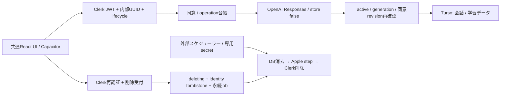

# Privacy / AI Consent / Account Lifecycle

2026-09-13。実装ブランチ `codex/privacy-lifecycle`、起点Dev `c774ed0863d8eb25cddc6db35022e6f124b6fb44`。Dev/mainへ未merge。本番配備・DB・Clerk設定変更なし。

## データフロー

## AIの実際の送信範囲

`lib/openai.ts` はResponses APIを直接fetchし、`store:false`。OpenAI SDKの自動retryなし。

| 機能 | OpenAIへ送るもの | Patchでの保存 |
| --- | --- | --- |
| カード生成 | 入力/抽出済み教材本文、言語、詳細度、形式、カテゴリ、system instructions、JSON schema、model等の生成設定 | 候補はブラウザworkspace、保存操作後にDB |
| AI Chat | DBで所有権を確認したカードQ/A・カテゴリ・原文、関連会話履歴、ユーザー質問、言語/説明深度 | user/assistantのペアを同意再確認後にDB保存 |
| lesson summary | 学習画面が構成する会話要約用文章と生成設定 | 返された候補、ユーザー保存操作後にDB |

Email、ClerkのJWT、内部user IDをOpenAIへ明示的な識別子として送らない。ただし教材・質問本文に本人が含めた個人情報は本文として送られる。AI台帳はペイロードのSHA-256のみで本文を追加保存しない。エラーログに外部レスポンス/教材を出力しない。`store:false` はOpenAI側のすべての保持を即時ゼロにする約束ではない。送信済み処理の取消・外部保持の個別削除は未実装。

## 同意の契約

- Scope `ai_learning`。現行 `ai-learning-1` / `privacy-draft-1`。初期unset、明示操作でgranted/denied/revoked。
- user_consentsが正本。consent_eventsに操作ID、revision、state、両version、正確な表示文SHA-256、JA/EN、サーバー時刻を記録。現状ひとつのscope。
- 書込みはrevision CAS。古い許可操作の再送が新しい撤回を上書きしない。同じ操作IDの異なるpayloadは409。
- 未同意/拒否/撤回/古いconsent versionは全AI APIで403・外部call 0。APIを直接呼んでも迂回不可。オンボーディングのプリセット・既存教材の学習は同意不要。
- 最初の手動AI操作で情報・OpenAI・目的を表示。「今は許可しない」を初期focusにし、事前チェックなし。設定から停止/再許可可能。自動summaryで未同意の場合は静かに送信拒否。
- 停止操作は先に端末のscoped停止フラグを保存。同期失敗中も同端末の送信を止め、次のAI操作で撤回を同期する。通常logoutでは未同期停止フラグを消さない。他端末への停止はサーバーで撤回が保存されてから有効。
- アカウント切替では旧scopeのHTTP/モーダルpromiseを無効化。UIの同意だけを信用せず毎回サーバーでも確認。
- データ範囲/目的/送信先を変える更新ではconsent versionと説明文を変更し再同意。連絡先の訂正など範囲が変わらないPolicy更新ではpolicy versionだけ変更し、過去の同意証跡を保持する。公開用の正式Policy確定時に最初の再同意方針をレビューする。

## AI再送・競合

同一user/operation IDを予約後に一度だけ外部送信を試行。同時POSTの片方は409。timeout、process終了、送信前障害も同じIDは再送しない。結果不明はstartedとして残す。新しい手動操作は新しいIDで費用が発生し得る。UI/workerは自動で新しいIDを作って再試行しない。

同意撤回や削除が外部送信開始後に起きた場合、すでに出た通信は回収できない。応答後のDB保存/返却はgenerationとrevisionで拒否する。AI台帳の掃除は未実装：古い操作IDを消すと再送保証を失うため、保持方針決定前にTTLを入れない。

## 削除の契約

1. Settingsで対象データ・不可逆性・別端末/バックアップの制限を説明。
2. backend発行5分チャレンジに内部user、session、直前の署名済みreverification IDを保存。
3. Web/iOSのClerk標準emailコード再認証。完了後token cacheをskip。最終確認で削除送信。
4. backendは署名/issuer/session、未使用challenge、期限、以前と異なるreverification ID、5分未満のfirst-factor ageを検証。OTP値やクライアントbooleanは受け付けない。
5. 同じtransactionでjob + tombstone + deleting + generation増分 + challenge消費。ここが利用停止の確定点。
6. 対象workspaceとcleanup hooksを消去しlogout。NativeはKeychain消去をawaitしClerk runtimeを再構成。他人のactive sessionならpurgeしない。他端末は次のAPI拒否時にロック/消去。オフライン端末の遠隔即時消去は保証できない。
7. app終了と独立してスケジューラーがworkerを起動。DB所有データ消去→Apple判定→Clerk削除→auth identity解除→最小users行deleted。

DB削除対象: sources, folders, card_sets, cards, review_logs, chat_messages, daily_review_plans, user_profiles, user_consents, consent_events, ai_operations, deletion_challenges。すべて `WHERE user_id = 対象UUID`。loop-ownerを拒否し、移行もしない。

最小users行・identity SHA-256 tombstone・削除job（step/時刻/receipt hash）は再作成防止/再試行のため残す。completed時はjobの生issuer/subjectを空にする。hashを匿名情報とは主張しない。運用記録・backupの保持期限は未確定で、公開前に方針とpurge/restore手順を整える必要がある。

## 失敗と再試行

| 障害 | 動作 |
| --- | --- |
| 受付transaction失敗 | 全rollback。202を返さない |
| 受付応答消失 | 送信前保存した256-bit random receiptで状態確認。同operation/receiptの再送は受付jobを再利用 |
| Clerk失敗/未設定 | DB消去済みstepを維持、利用停止維持、job retry |
| DB消去失敗 | 所有データDELETEをrollback、Clerkに進まない |
| worker重複 | 120秒leaseをDB write transactionで取得、tokenでfence。1呼出し1job |
| worker終了 | lease期限後に別workerが引継ぐ。DELETE/Clerk404は冪等 |
| retry | 約1分から指数増加、上限6時間＋小さいjitter。last_errorは固定codeのみ |
| Keychain/cleanup hook失敗 | private UIをロックし、sessionごとの消去intentで再起動後も再開 |
| Apple連携済みと判明 | apple_step=pending。revokeApple未実装ならretryで止め、completedにしない |

worker routeはPOSTのみ。GETのVercel Cronをそのまま設定しても動かない。POSTできる外部scheduler/queue、または別途認証済みcron adapterが必要。起動間隔と滞留検知を運用で設定する。無期限retryを放置せず、古いpending/last_errorを監視する。

## 本番前に手動設定するもの

- 同じProduction Clerk instanceをWeb/Native/APIで利用。既存Phase 2Aのissuer/origin/keys設定は [phase-2a-auth.md](phase-2a-auth.md)。
- Clerk Sessionsのカスタムsession token claimに `"reverification_id": "{{session.reverification_id}}"` を追加。標準 `fva` も必要。未設定では削除はfail closed。Email codeによる再認証を有効にし、実際のユーザー/セッションで検証する。MFAやApple追加時のfactor選択は別途拡張する。
- `CLERK_SECRET_KEY` にユーザー参照/削除権限が必要。設定値をアプリに埋め込まない。
- `ACCOUNT_DELETION_WORKER_SECRET`: 32文字以上のランダムsecret。schedulerが `Authorization: Bearer <secret>` でPOST。環境変数の追加だけではjobは実行されない。
- 運営者、正式Support/Privacy/Terms URL、保持期間/backup削除期限を確定し、準備中のコンテンツを置換する。未確定のままApp Storeに提出しない。
- 本番migration適用前にステージングでbackup/復元検証。バックアップ復元で削除済みidentity/データを復活させないよう、別保全した削除台帳を照合してアクセス公開前に再削除。現状はその外部台帳/監視の配備は未実装。

Clerkの公式仕様: [reverification](https://clerk.com/docs/guides/secure/reverification)、[signed token claims](https://clerk.com/docs/guides/sessions/session-tokens)。新しいIDとfactor ageを署名済みtokenで確認する方式。実際のproduction設定・SDK動作の確認はテストfixtureで代用しない。

## マイグレーションと統合

`0008_privacy_lifecycle.sql` + meta snapshot/journal。usersに2列、6テーブル、所有者のINSERT/UPDATE防止trigger。Production Infrastructure統合後は明示的runnerのみで適用。requestはmanifestとのschema一致を読むだけで、未適用は503。0008を含むmanifestを生成済み。本番未適用。down migration、既存データ移送/削除、loop-owner引継ぎなし。

Retention/Widget統合で新しい所有データを作る場合、worker削除リスト・inactive書込み防止・cleanup hook・テストに同時追加する。hookは `(userId) => Promise<void>`、対象UUID以外は操作しない。再起動で繰り返し呼ばれるので冪等にする。

競合しやすいファイル: `db/schema.ts`, `drizzle/meta/*`, 次のmigration番号、`app/settings-dialog.tsx`, `app/auth-provider.tsx`, `app/page.tsx`, `app/globals.css`, `ios/App/App/PatchAuthPlugin.swift`, `package.json`, `ARCHITECTURE.md`, `STATUS.md`。Retention側のschema追加は0008を上書きせず新番号へ。

テストはSTATUS参照。Apple revocation実動作/APNs/Widget/App Groups、Production DB/Clerk削除、実機Keychain、正式法務文書、cron配備、AI予算・レート制限は今回未実施。
